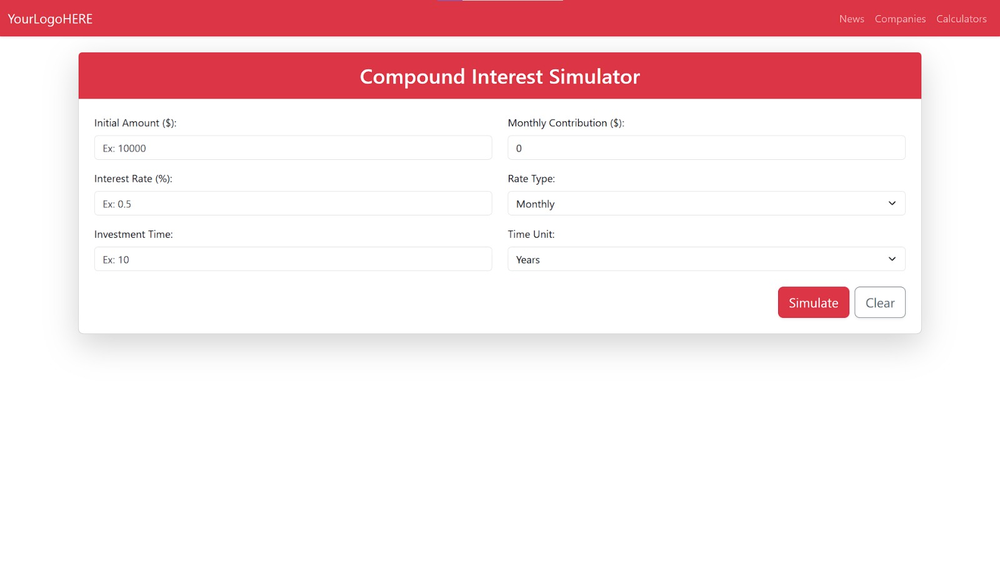
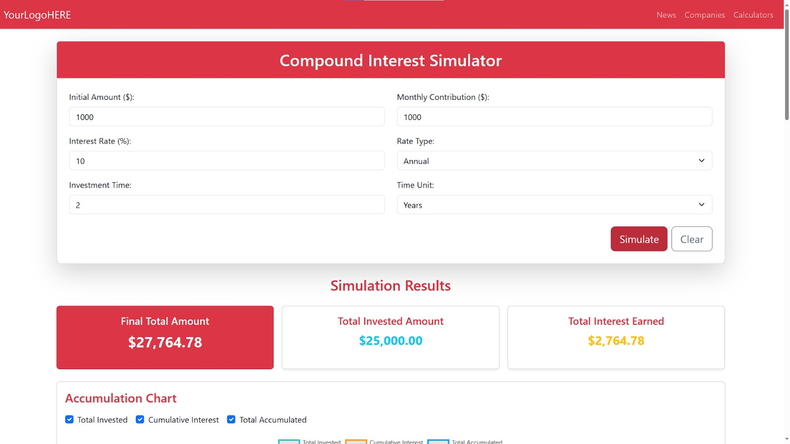
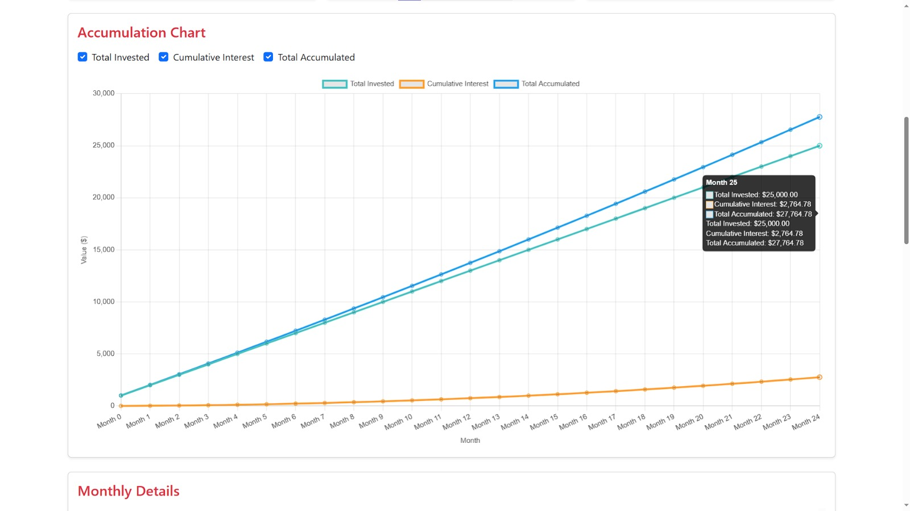
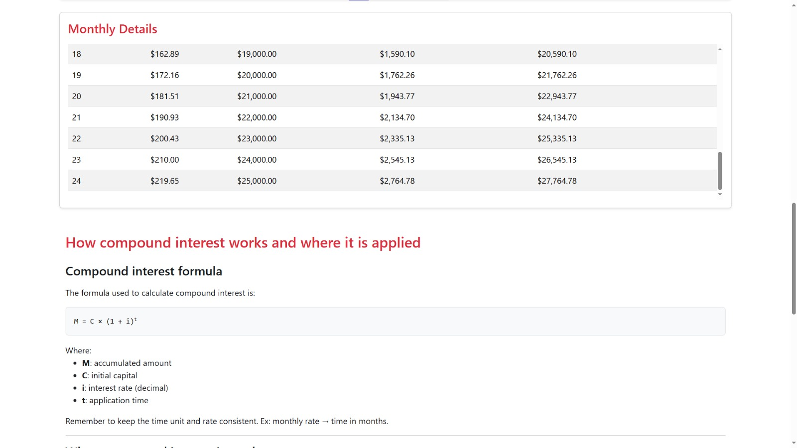

# Finance Simulator

[](https://opensource.org/licenses/MIT)
[](https://spring.io/projects/spring-boot)
[](https://reactjs.org/)
[](https://www.java.com/)
[](https://developer.mozilla.org/en-US/docs/Web/JavaScript)

A white-label income simulation tool built with Spring Boot and React. It allows users to simulate compound interest investments and visualize the results.

## Table of Contents

- [About the Project](#about-the-project)
- [Screenshots](#screenshots)
- [Features](#features)
- [Getting Started](#getting-started)
  - [Prerequisites](#prerequisites)
  - [Installation](#installation)
- [Usage](#usage)
- [Folder Structure](#folder-structure)
- [API Endpoints](#api-endpoints)
- [Contributing](#contributing)
- [License](#license)
- [Contact](#contact)

## About the Project

This project is a financial simulator that helps users understand the power of compound interest. It provides a user-friendly interface to input investment details and see the projected growth over time.

## Screenshots

### Initial Page
*Initial page where the user adds the values*


### Simulation Results
*Here the user has submitted the form and now sees the simulation results*


### Accumulation Chart
*This is the chart with total invested, cumulative interest, and total accumulated*


### Monthly Details
*This is a table with the monthly values*



## Features

- **Compound Interest Simulation:** Calculate the future value of an investment with various parameters.
- **Interactive Charts:** Visualize the investment growth, total invested amount, and interest earned over time.
- **Detailed Monthly Breakdown:** See a month-by-month table of the investment's progress.
- **Bilingual Support:** The application is available in both English and Portuguese.
- **Flexible Currency:** The currency symbol can be easily changed to any currency.

## Getting Started

To get a local copy up and running follow these simple steps.

### Prerequisites

- **Java Development Kit (JDK) 17 or higher:**
  - You can download it from [Oracle](https://www.oracle.com/java/technologies/downloads/) or use a version manager like [SDKMAN!](https://sdkman.io/).
- **Node.js and npm:**
  - You can download them from [nodejs.org](https://nodejs.org/).

### Installation

1.  **Clone the repository:**
    ```sh
    git clone https://github.com/your_username/finance-simulator.git
    cd finance-simulator
    ```
2.  **Backend Setup:**
    - Navigate to the `backend` directory:
      ```sh
      cd backend
      ```
    - Run the Spring Boot application:
      ```sh
      ./mvnw spring-boot:run
      ```
    - The backend server will start on `http://localhost:8081`.

3.  **Frontend Setup:**
    - Open a new terminal and navigate to the `frontend` directory:
      ```sh
      cd frontend
      ```
    - Install the required packages:
      ```sh
      npm install
      ```
    - Start the React development server:
      ```sh
      npm start
      ```
    - The frontend application will be accessible at `http://localhost:3000`.

## Usage

Once both the backend and frontend are running, open your browser and go to `http://localhost:3000`. You can then use the simulator to enter your investment details and see the results.

## Folder Structure

```
.
├── backend
│   ├── src
│   └── pom.xml
├── frontend
│   ├── public
│   ├── src
│   └── package.json
└── README.md
```

## API Endpoints

The backend exposes the following REST API endpoint:

- **`POST /api/simulation`**:
  - **Description:** Simulates compound interest based on the provided data.
  - **Request Body:**
    ```json
    {
      "initialAmount": 1000.00,
      "monthlyContribution": 100.00,
      "interestRate": 5.0,
      "interestRateType": "annual",
      "investmentTime": 10,
      "investmentTimeUnit": "years"
    }
    ```
  - **Success Response (200 OK):**
    ```json
    {
      "finalTotalAmount": 17134.74,
      "totalInvestedAmount": 13000.00,
      "totalInterestEarned": 4134.74,
      "monthlyData": [
        // ... array of monthly data
      ]
    }
    ```

## Contributing

Contributions are what make the open source community such an amazing place to learn, inspire, and create. Any contributions you make are **greatly appreciated**.

1.  Fork the Project
2.  Create your Feature Branch (`git checkout -b feature/AmazingFeature`)
3.  Commit your Changes (`git commit -m 'Add some AmazingFeature'`)
4.  Push to the Branch (`git push origin feature/AmazingFeature`)
5.  Open a Pull Request

## License

Distributed under the MIT License. See `LICENSE` for more information.

